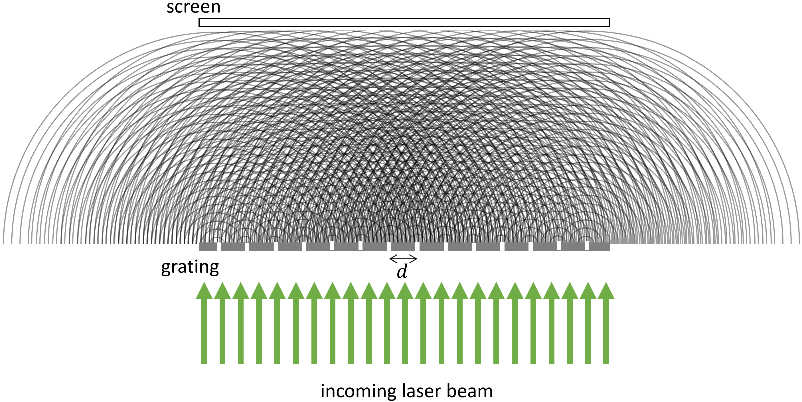

## Module 3 Background Theory

In special relativity we treated light as individual particles of light called photons. However, as you learned in Physics 51, light is often described as an electromagnetic wave – periodic fluctuations of the electric and magnetic fields that travel at the speed of light. It turns out that light can be described as both a wave and a particle. For the remainder of this section we treat light as an electromagnetic wave and not as a particle. The particle treatment is pursued at the end of Physics 51 and, if you choose to continue taking physics at Mudd, the beginning of Physics 52.

Before we get into the mathematical details of how electromagnetic waves behave let us get a better visualization of what is happening by thinking about water waves. In the right half of the photo below (taken by Google Earth off the Australian coastline) we can see water waves traveling as a plane wave from right to left.

**Figure 1**: A photo off the coast of Australia showing the diffraction of a wave as it passes from right to left through an aperture, or opening, in an otherwise barrier of rocks. As the wave travels it hits a barrier of rocks with an opening (aperture) that allows the wave to pass through. Notice, however, that the water coming out of this aperture is no longer a flat plane wave but rather is coming out in a circular manner traveling away from the center of the aperture. It is as though the aperture is a wave source of its own, sending waves out in all directions rather than just the initial right-to-left direction! The water wave bends as it passes through the aperture; this is diffraction. Photo credit: Google Earth.

 

Let us now return to light. When a plane wave of light passes through an aperture it, like the water wave, bends and changes shape. In fact, if you send a single laser beam through a narrow slit and observe the light that has passed through the slit on a screen (serving as a backdrop) then you will see two main effects, as shown below in Figure 2. First, the light spreads out over a much broader angle than the original laser beam – even though the slit was much narrower than the original laser beam. This behavior is similar to what we saw for water waves in the photo above: a narrow aperture sends waves out in all directions, not just the original direction. Second, the spread-out light displays an interference pattern. The interference pattern comes from superposition of waves spreading out from the different spots within the narrow slit; it’s difficult to observe in the water case because of some numerical values that are different between the ocean water example and the laser light example.

 **Figure 2**: The diffraction pattern from a monochromatic light source traveling through a single slit aperture.

The mathematical details of how the interference pattern comes about are beyond the scope of Physics 50, but the take-away is this. After passing through the single slit aperture the beam will form a central, spread-out bright peak and several less bright peaks on either side. The separation between the brightest peak and the next-brightest peak depends upon the frequency and wavelength of the monochromatic (single-wavelength) light passing through the slit, as well as the size of the slit and the distance between the slit and the screen upon which you are observing the pattern. The narrower the slit the larger the distance between dark spots (minima).

Now let’s imagine the laser light passes through two slits in the slide rather than one. In other words, the laser beam is now blocked by an opaque slide that has two narrow, identical slits that the light can pass through. The light passing through two slits will now create a pattern as shown below in Figure 3.

**Figure 3**: Diffraction pattern from laser light passing through a double slit. What similarities and differences do you observe between the single slit (Figure 2) and double slit patterns?

The latter arrangement is Thomas Young’s famous double-slit experiment and is an excellent demonstration of the wave-like properties of light. While this experiment is well known for demonstrating the wave nature of light, it also allows the experimenter to measure the wavelength and frequency of the light source, in this case a laser. These are properties of light on which many scientific experiments depend, such as LIGO (the Laser Interferometer Gravitational Wave Observatory, the facility behind the 2017 Nobel Prize in Physics) as well as everyday technology such as blu-ray players, grocery-store barcode scanners, and more.
To understand the pattern of bright spots caused by two slits, we can think of light emerging from each slit as a point source, traveling outward in all directions from each slit. That is, the incoming light wave essentially splits into two smaller waves that emanate from the two slits. This is called **Huygen’s principle**. Figure 4 below shows a simplified schematic of the waves emanating from two slits - the semicircular curves represent wave crests, and the separation between the curves is the wavelength of the light. This schematic is very not to scale, since in reality both the spacing $$d$$ between the slits and the wavelength $$\lambda$$ of the laser light are much, much smaller than the separation $$L$$ between the slits and the screen where the diffraction pattern is being viewed.

**Figure 4**: Simplified schematic of light waves passing upward through a double-slit slide, leading to constructive interference at certain angles - red lines indicate angles where the two waves constructively interfere to cause bright spots where the red lines meet the screen. *This schematic is very much not to scale.*

It might be helpful to think of Figure 4 as also representing the pattern of waves produced by dropping two stones simultaneously into a calm body of water. Here the separation distance between the two stones is analogous to the slit separation distance $$d$$. The ripples produced by a single stone will propagate outward in concentric semicircles about the location where the stone contacted the water. 

In Figure 4, the red lines represent positions where wave crests interfere constructively with each other -- that is, the positions where the two waves are in phase and superpose. Notice that constructive interference happens at certain angles away from the upwards, or straight-ahead, direction, leading to the specific bright spots located where the red lines meet the screen in the figure. In between these maxima, there are dark spots that correspond to angles where the two wave crests perfectly cancel out, causing destructive interference.

## Diffraction Gratings

In Module 3, you will be investigating the diffraction pattern caused not by two slits, but by a **diffraction grating** with many, many slits, all separated by the same distance $$d$$. For such a scenario, it’s not as easy to see the angles of constructive interference by drawing the wave crests (see Figure 5 below). 

**Figure 5**: Schematic of wave crests emerging from a diffraction grating. *This schematic is very much not to scale.*

 

Instead of drawing out wave crests, for the diffraction grating we will think about the light as rays emanating in all directions from each slit, and focus on just those rays that all eventually land at a single point on the screen, as shown by the green lines in Figure 6. For simplicity, only 4 rays have been shown, from four neighboring slits. Each ray ends at the same point a distance $$x$$ from the center of the screen. We emphasize that this schematic is very, very much not to scale. In reality, the distance between the slits in the diffraction grating is six orders of magnitude smaller than the distance $$L$$ between the grating and the screen -- that’s like the difference between 1 cm and 10 km! So it therefore makes sense to use the following approximation, which is very accurate for our experiment:

**We can approximate that all the rays that end at the same point on the screen are parallel to one another.**

 

**Figure 6**: Schematic of light rays emerging from a diffraction grating. Only four rays have been highlighted, and all four reach the same point on the screen, a distance $$x$$ away from the center. *This schematic is very much not to scale.*

That means that the four green lines in Figure 6 are treated as approximately parallel to each other, and that is a very reasonable approximation, since $$L \gg x$$. So a better-scaled and ultimately more useful drawing would zoom in to just the region right above the diffraction grating, where the screen is *way* out of view and the rays that are all headed to the same position $$x$$ will indeed be parallel, as shown in Figure 7.

 

**Figure 7**: Schematic of light rays emerging from a diffraction grating. All five rays shown land at the same point on the very distant screen. *This schematic is reasonably to scale.*

In Figure 7, we can see that the total distance traveled by light is different along each ray coming from each slit. Relative to the rightmost ray in Figure 7, each consecutive ray is longer by an additional length $$d sin \theta$$.

## The Takeaway: 

**When the extra distance $$d \sin \theta$$ traveled by light on adjacent rays is equal to an integer number of wavelengths, then all the rays will interfere constructively at the point where they land on the screen, creating a bright spot.** 

Mathematically, this condition is met if $$d \sin \theta = n \lambda$$, where $$n$$ is a positive integer and $$\lambda$$ is the wavelength of the light.

We can do a little more to simplify this expression. From Figure 6, we can see that $$\sin \theta = x / \sqrt{(x^2 + L^2)}$$, and if we only look at the separation between the central bright spot and the first one or two bright spots around it, then $$x << L$$ so we can approximate that $$\sin \theta = x / L$$. Substituting this into our constructive interference condition gives us the following expression:

\begin{equation}\label{eq:sYoung} 
\frac{xd}{L} = n \lambda
\end{equation}

**In Module 3, we will use this relationship to determine $$\lambda$$, the wavelength of the laser, by measuring $$x$$ and $$L$$ and using the quoted value of $$d$$ for the provided diffraction grating.**
