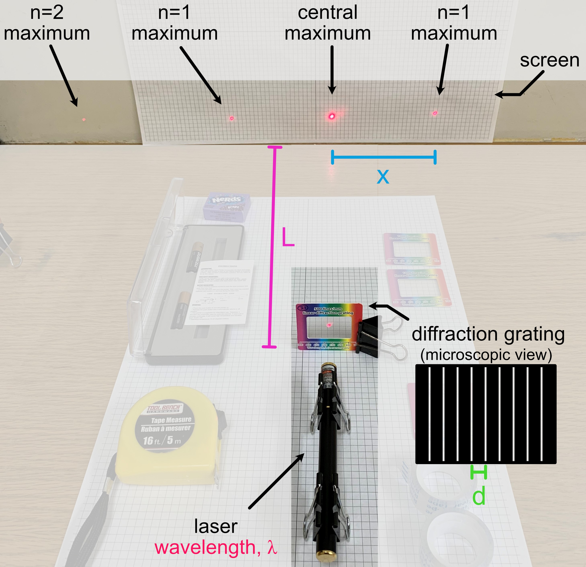
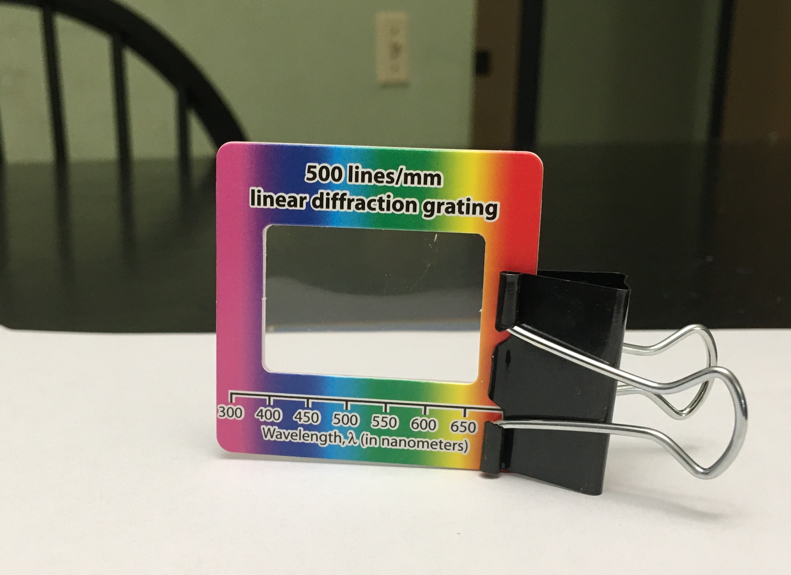
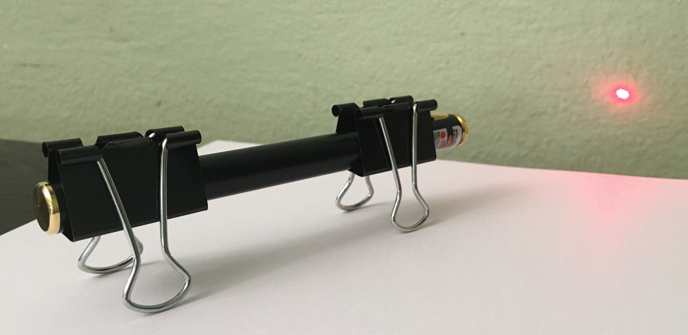
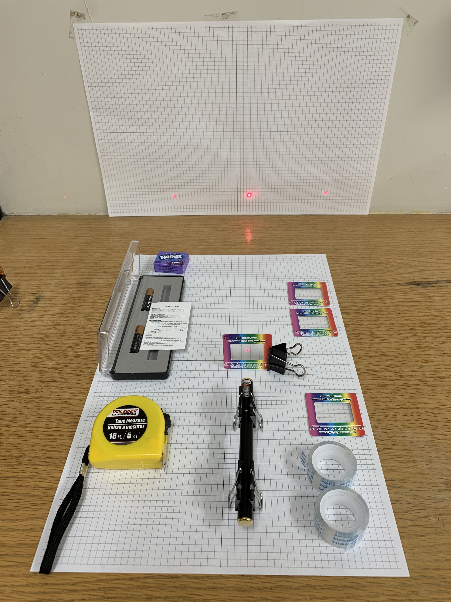

# Week 1: Exploratory Phase

--------------
1. [Background Theory](#background-theory)
2. [Summary of Key Formulae from Theory](#the-takeaway)
3. [Setting up your experiment](#setting-up-your-experiment)
4. [Exploratory Measurements](#exploratory-measurements) 
5. [Checkpoint 1](#checkpoint-1)

--------------

In this module you will be studying a light interference effect called <strong>diffraction</strong>. This phenomenon will allow you to measure the wavelength of visible light ($$ <10^{-6}$$ meters).

## Background Theory

Start by reading the [background theory for Module 3 here](background-theory){:target="_blank"}.

 

**Before moving on, make sure you have read through the background theory at the link above!**

  

## Module 3 Goal

In Module 3, we will use the relationship derived in the background theory to determine $$\lambda$$, the wavelength of the laser, by measuring $$x$$ and $$L$$ for the first diffraction maximum ($$n=1$$), and using the quoted value of $$d$$ for the provided diffraction grating:

\begin{equation}\label{eq:sYoung} 
\frac{xd}{L} = n \lambda
\end{equation}

## Setting Up Your Experiment

We will begin by setting up to do diffraction measurements. Find a room where you can turn out the lights and work in the dark. You will need a workspace with a vertical support such as a wall to which you can mount the grid paper we provided you with. Go ahead and mount the grid paper (e.g. tape it to a wall).

We don't want the laser light shooting across the room, please make sure when you set up your laser pointer that it is directed toward the wall with the mounted grid paper and not toward yourself or family members. But NEVER check this, or the alignment of the various items, by placing your eye directly in the laser beam path. Even if you are sure the laser is currently off, you should <strong>never look directly down the beam path.</strong>

We will begin by setting up the experiment. Attach one of the 500 lines/mm diffraction gratings to the binder clip, as shown below. When handling the diffraction grating make sure to only touch the cardboard rim. Getting fingerprints on the region with the grating could affect your results.

A diffraction grating is essentially just an array of slits placed right next to each other, with a very small slit distance <em>d</em> between each (on the order of one slit per micron!). Each neighboring pair of slits can be thought of as a double slit. 

_____________________

#### Miniquestion 1: Spacing of Diffraction Gratings
*[Click here to open in a new tab](https://docs.google.com/forms/d/e/1FAIpQLScVy13Ddgurh38icYTvtZDd7mcRiIQcisnRfS6NIwLRf8om4Q/viewform?){:target="_blank"}*

<iframe src="https://docs.google.com/forms/d/e/1FAIpQLScVy13Ddgurh38icYTvtZDd7mcRiIQcisnRfS6NIwLRf8om4Q/viewform?embedded=true" width="640" height="400" frameborder="0" marginheight="0" marginwidth="0">Loading…
</iframe>

-----

#### Miniquestion 2: Spacing of Interference Maxima
*[Click here to open in a new tab](https://docs.google.com/forms/d/e/1FAIpQLSd0DalK3dCoRR8n6thQmaJmh4ctFmaWsDRalbRIW35mO1FA_w/viewform){:target="_blank"}*

<iframe src="https://docs.google.com/forms/d/e/1FAIpQLSd0DalK3dCoRR8n6thQmaJmh4ctFmaWsDRalbRIW35mO1FA_w/viewform?embedded=true" width="640" height="400" frameborder="0" marginheight="0" marginwidth="0">Loading…
</iframe>

------------------------------

Use two additional binder clips to mount the laser as shown (making sure that the laser is pointing towards a wall/screen at all times when on):

Take note that you can position the binder clip in such a way as to keep the laser on while taking measurements (but remember to turn it off in between to conserve your batteries). **Turn off your laser when inserting new components into the beam path**; it is hard to make sure that stray reflections don't momentarily hit someone in the eye while inserting pieces of glass or metal into a beam path.

Position the diffraction grating between the laser and screen. 

You will want to use the grid paper and tape measure to measure the spacing between interference maxima as well as the distance of the diffraction grating from the screen. In planning your experiment you will want to think about how to do this as accurately as possible. What are the dominant sources of error. What can you do to minimize systematic error? Even when you've done your best to reduce systematic error, some will remain. What can you do to randomize the remaining systematic error? Why is this helpful?

For this module we expect you to set-up your own spreadsheet but if you start from the blank spreadsheet we've shared with you the sharing permissions will be set-up so that we can see your work [assigned from Google Classroom](https://classroom.google.com/c/MTI2NjQ0NDEyMTAx/a/MjAyODE1ODE3OTY5/details){:target="_blank"}. Organizing your spreadsheet carefully will make your work easier.

Think about which parameters correspond to $$x$$, $$L$$, and $$d$$ in your experimental set-up, as compared to the theory above. (You will find it helpful to notice that the number of slits per mm is written on the front of the diffraction grating). <strong>Make sure you are using one of the diffraction gratings with 500 lines/mm. </strong> Label each of your diffraction gratings, so you know which one you used this week. For example, write "A" or "B" in marker on the cardboard part of the diffraction gratings to label them.

## Exploratory Measurements

As in previous modules, you should perform the following exploratory measurements and record them in your [data sheet assigned from Google Classroom](https://classroom.google.com/c/MTI2NjQ0NDEyMTAx/a/MjAyODE1ODE3OTY5/details){:target="_blank"}

1. **perform a single measurement**
    + for a single $$L$$ measure $$x$$ and calculate $$\lambda$$; is your value reasonable? (e.g. is it between the value quoted on the sticker of the laser pointer 630-680 nm?)
    + what are the resolution uncertainty in your measured values of $$x$$ and $$L$$? which relative (fractional) resolution uncertainty is greater $$(\delta_\mathrm{res.} x)/x$$ or $$(\delta_\mathrm{res.} L)/L$$? 
2. **test repeatability**
    + at a fixed $$L$$, repeat the measurement of $$x$$ several times, fully resetting the experiment between each measurement
    + based on this, what is the dominant source of uncertainty: random or resolution?

3. **explore other factors**
    + think of other variables you can change, make some preliminary observations of their effect
    + are you getting the same value of $$x$$ when you measure the 1st maximum to the left of the central maximum vs the 1st maximum to the right? 

#### Miniquestion 3: Exploring other factors
[*Click here to open in a new tab (recommended)*](https://forms.gle/NYhuVfiRRrmrzUi59){:target="_blank"}
<iframe src="https://docs.google.com/forms/d/e/1FAIpQLSe3T538QpIwC2e9FGaTT_T6NgMcHjHkPpaEdel3hD0dAHzAJw/viewform?embedded=true" width="640" height="400" frameborder="0" marginheight="0" marginwidth="0">Loading…
</iframe>

 

## Getting a complete data set for a single diffraction grating

One of the most important ideas we want you to take from Module 3, is to **think of a data set as a whole, not as individual points**. 

In the exploratory analysis, you got a measurement of $$x$$ at a single value of $$L$$. By repeating that same measurement you got an idea of the uncertainty of that single measurement $$x$$. But $$L$$ provides us with an independent variable that we can control, so by varying $$L$$ and repeating the measurement, we can create a plot of $$x$$ versus $$L$$. By plotting the data and looking at the data set as a whole, we can gain confidence in our measurement. We can also fit the data to the theoretical prediction in a more robust way if we are including more data points. 

Thinking back to the theoretical prediction of Eq.\eqref{eq:sYoung} for how $$x$$ and $$L$$ should be related, let's rewrite that equation in a more suggestive form for the first maximum ($$n=1$$)
\begin{equation}
x = \left(\frac{\lambda}{d}\right) L + 0
\end{equation}
where we have added zero to the right hand side. This should look familiar, it's the equation of a straight line (classic $$y=mx+b$$), where if we plotted $$x$$ versus $$L$$, we should get a slope $$m=\lambda/d$$, and an intercept $$b=0$$. There's an added power to treating the data set as a whole in this way because if our data has an intercept that isn't zero, then that would suggest a systematic effect that shifted our measured values!

How do we extract a slope an intercept from our measured data? We need to perform a least squares fit (linear regression). This might be something you have done previously, but in Ph50 we need to do a **weighted fit** that gives **uncertainty estimates of the fitted parameters**, and provides the **reduced chi-squared** value so we can assess how good the fit is. We have provided a MATLAB script for you that does this type of fit. Please see this [curve fitting guide](curve-fitting){:target="_blank"} before moving on.

 

Please read the [curve fitting guide](curve-fitting){:target="_blank"} before answering the following miniquestion

#### Miniquestion 4: Interpreting a weighted linear fit
[*Click here to open in a new tab (recommended)*](https://forms.gle/BF8fQq5PNWF1Gh9U8){:target="_blank"}
<iframe src="https://docs.google.com/forms/d/e/1FAIpQLSdTk_l5gJ2boQzujZcgNKYh55iSlxR9UZNke6sgi3Chk_dvmA/viewform?embedded=true" width="640" height="400" frameborder="0" marginheight="0" marginwidth="0">Loading…
</iframe>

 

### Data Collection

Collect a set of data of $$x$$ vs $$L$$ for one of the 500 line/mm diffraction gratings. Once you have collected the appropriate data, make use of the MATLAB curve fitting script to perform a best fit analysis. Make sure to consider relevant sources of both resolution uncertainty and random error in determining the uncertainty of your data points. 

You should make use of your data, the best fit analysis and the provided theory to determine the wavelength of your laser. You will need to use the methods you have been taught in the previous units to propagate your uncertainty and determine the uncertainty in your final result. **You have been provided with four diffraction gratings but for this week you only need to present results from one of the 500 line/mm diffraction gratings.** And don't forget to label each of your diffraction gratings, so you know which one you used this week.

-------------

## Checkpoint 1

You should submit the following on Gradescope:

+ The plot used to determine the wavelength of your laser. This plot must include the uncertainties on your data points and include a line of best fit that has been determined with a weighted fit. As always make sure to include units on your axis labels.

+ The slope you obtained from your plot including the uncertainty. Please include the appropriate units.

+ The wavelength you have determined for your laser with uncertainty.

+ A link to a spreadsheet with your experimental data

+ An answer to the following question: Next week we will continue to collect more data to better determine the wavelength of our laser. What are a few things you might do to try if possible to both minimize sources of uncertainty and randomize sources of systemtic error?

+ [Submit the results of your measurements (from a single diffraction grating) on Gradescope](https://www.gradescope.com/courses/165932/assignments/790237/){:target="_blank"}

+ And to double-check, make sure you have finished all of this week's mini-questions by [checking here](mini-questions#week-1){:target="_blank"}

When you're ready, please move on to [Week 2](week2).