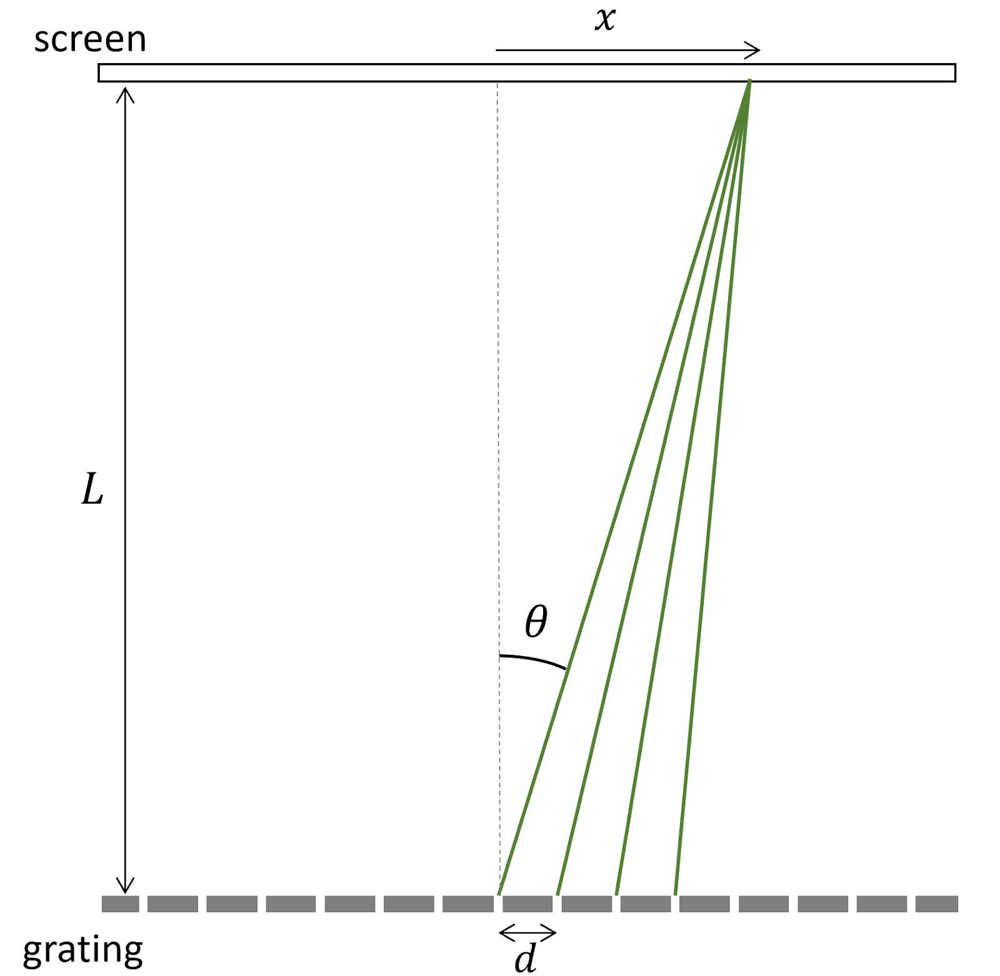

# Week 3 - Finalizing Results

--------------
1. [Experimental Iteration](#experimental-iteration)
2. [Setting up your experiment](#setting-up-your-experiment)
3. [Checkpoint 3](#checkpoint-3)

--------------

This week we will continue our investigation of the wavelength the light from the laser pointer you have been working with. 

## Experimental Iteration

We noticed that many of your results showed significant discrepancies between the results measured with the two gratings. Please take a moment to reflect on those results.

Did your results from the two differently spaced diffraction gratings agree? Did they agree with the wavelength specified by the manufacturer?

By the end of this week you should have given serious consideration to possible sources of experimental error. Here are a few of examples:

1. We provided two diffraction gratings for each diffraction grating spacing. Did you collect data from both (four diffraction gratings in total). Did the results from the gratings with the same spacing agree? 

2. Were you careful to ensure that your beam path was perpendicular to the laser? Hint: when the laser reaches the diffraction grating, part of the beam will be reflected. Ensuring the reflected beam retraces its path can help with aligning the diffraction grating perpendicular to the beam. 

3. Were you careful to ensure your beam path was perpendicular to the screen? It can be helpful to compare the distance to the first maxima to the left and right as part of this consideration.

4. Were you careful to ensure your beam path is horizontal to the floor?

5. Did you collect data over a wide range of L values?

6. What other sources of error can you think of?

You will not be able to completely eliminate any of these sources of error, but you should do your best to minimize them and once you have done so, to randomizing the remaining error. **If you are spending more than 30 minutes on data collection this week, please proceed with the miniquestion and come to office hours to discuss.** 

When you feel confident you have made your best effort to get a good data set in which you feel the uncertainties accurately reflect your experiment please proceed to the mini-question below. If no concerns were raised with your checkpoint and you feel you already made an effort to control these potential sources of systematic error you can proceed straight to the mini-question.

----------------------

#### Miniquestion 1: What next?

*[Click here to open in a new tab](https://docs.google.com/forms/d/e/1FAIpQLSeF85mLdADYHRDn3v3ciPKl8TPqTIbpI7X9c-1N7DUKFsP9PA/viewform?){:target="_blank"}*

<iframe src="https://docs.google.com/forms/d/e/1FAIpQLSeF85mLdADYHRDn3v3ciPKl8TPqTIbpI7X9c-1N7DUKFsP9PA/viewform?embedded=true" width="500" height="600" frameborder="0" marginheight="0" marginwidth="0">Loading…
</iframe>

  

------------------------------

  

 Please do not read further until you have answered the above mini-question

  

------------

  

In the background theory of week 1, we made a geometric argument to determine the location of interference maxima for a two slit diffraction pattern:

 

and argued that when the extra distance $$d \sin \theta$$ traveled by light on adjacent rays is equal to an integer number of wavelengths, then all the rays will interfere constructively at the point where they land on the screen, creating a bright spot.

Mathematically, this condition is met if $$d \sin \theta = n \lambda$$, where $$n$$ is a positive integer and $$\lambda$$ is the wavelength of the light.

From the figure above, we determined that $$\sin \theta = x / \sqrt{(x^2 + L^2)}$$, and then made the approximation that $$x << L$$ so we could approximate that $$\sin \theta = x / L$$. We then substituted this into our constructive interference condition to give:

\begin{equation}\label{eq:sYoung} 
\frac{xd}{L} = n \lambda
\end{equation}

But if we hadn't made that approximation, we get 

$$\frac{n \lambda}{d} = \frac{x}{\sqrt{x^2+L^2}}.$$

Setting $$n=1$$ for the first diffraction maximum and dividing the numerator and denominator on the right hand side by $$L$$ gives,

$$\lambda = d \frac{x/L}{\sqrt{(x/L)^2 + 1}}.$$

Then using the slope, $$m$$, of our $$x$$ vs. $$L$$ linear regression, with $$m=x/L$$, we arrive at **our main result:**
\begin{equation} \label{eq:Young}
\lambda = d \frac{m}{\sqrt{m^2 + 1}}
\end{equation}

In Week 3, we will recalculate our measured value of $$\lambda$$ from the correct version of Young's equation (Eq.\eqref{eq:Young}). **The good news is that we don't have to collect any more data!** The slopes we measured from the $$x$$ vs. $$L$$ plots of our data are not affected by the theory, so we only need to recalculate the measured wavelength based on data we have already collected.

To get a sense of how significantly this would impact our different diffraction gratings, we can rearrange Eq.\eqref{eq:Young} 

$$m = \frac{\lambda/d}{\sqrt{1-(\lambda/d)^2}},$$

which shows that the correct version of the theory introduces an extra factor of $$\sqrt{1-(\lambda/d)^2}$$. According to this analysis, please answer the miniquestions below.

----------------------

#### Miniquestion 2: How does the correction in Young's formula compare for the two diffraction gratings?

*[Click here to open in a new tab](https://docs.google.com/forms/d/e/1FAIpQLSc0X_Fkrha96zmuUgdJoqBOsre-V8M98C_jpvZ7PeuGnDYbLw/viewform?){:target="_blank"}*

<iframe src="https://docs.google.com/forms/d/e/1FAIpQLSc0X_Fkrha96zmuUgdJoqBOsre-V8M98C_jpvZ7PeuGnDYbLw/viewform?embedded=true" width="640" height="300" frameborder="0" marginheight="0" marginwidth="0">Loading…
</iframe>
------------------------------

----------------------

#### Miniquestion 3: Which grating will require a more significant correction?

*[Click here to open in a new tab](https://docs.google.com/forms/d/e/1FAIpQLScpGsKwbwDvNv5msFADlcFoWF8CY_G4U0_RSpt-ZVFbyhsycA/viewform?){:target="_blank"}*

<iframe src="https://docs.google.com/forms/d/e/1FAIpQLScpGsKwbwDvNv5msFADlcFoWF8CY_G4U0_RSpt-ZVFbyhsycA/viewform?embedded=true" width="640" height="300" frameborder="0" marginheight="0" marginwidth="0">Loading…
</iframe>
------------------------------

With the correct version of Young's equation in mind, please go back and recalculate your wavelength with uncertainty for your data. You will need to propagate the uncertainty using the techniques we have used for Module 1 and Module 2. If you'd like a refresher, please review the [Propagation of Uncertainties](https://physics-50.github.io/Module-1/uncertainty-introduction.html#propagation-of-uncertainties){:target="_blank"} lesson from Module 1. To make sure that you have done the uncertainty propagation correctly, please answer the miniquestion below.

#### Miniquestion 4: Wavelength uncertainty
[*Click here to open in a new tab*](https://forms.gle/PrC7jo58zqBs4MwT8){:target="_blank"}
<iframe src="https://docs.google.com/forms/d/e/1FAIpQLSdzBYlwEqg1ZVvQgohJ66SRDMkmOZYcHI3KVBitTMqKf_1O3w/viewform?embedded=true" width="640" height="400" frameborder="0" marginheight="0" marginwidth="0">Loading…
</iframe>

-------------

## Checkpoint 3 -- Sequence of Figures

You main task this week is to come up with a sequence of 3-5 figures that you will use for your poster. Your poster will present a main result (your best measurement of the wavelength of your laser pointer with uncertainty) and a secondary result (where you explored a significant systematic effect on the measurement). You should use the correct version of the theory from equation \eqref{eq:Young} in your poster. 

In thinking of which figures to produce, you should review the discussion on [creating a sequence of figures from Module 2 Week 4](https://physics-50.github.io/Module-2/week4){:target="_blank"}. The intent of your sequence of figures and poster **is not** to take your reader on a convoluted journey of the entire sequence of events you pursued over the course of your experiments. Rather, you should focus on your main and secondary results, and also the information your reader needs to understand the method and logic you used to arrive at those results. Specifically, you **should not** include any result that you derived using an incorrect theory in your sequence of figures. 

You should submit the following [here on Gradescope](https://www.gradescope.com/courses/165932/assignments/828013){:target="_blank"}:

+ A sequence of 3-5 figures with captions that summarize your results from Module 3

When you're all finished and ready to move on, you can start [Week 4 - 
Scientific Communication](week4).
