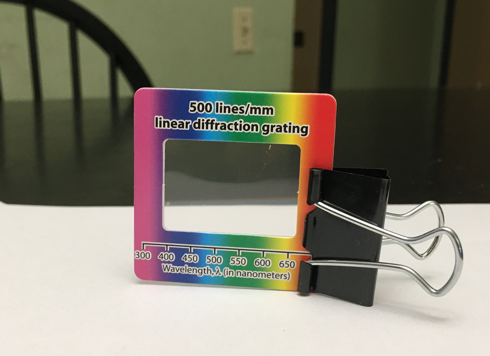

# Week 1: Exploratory Phase

--------------
1. [Background Theory](#background-theory)
2. [Summary of Key Formulae from Theory](#the-takeaway)
3. [Setting up your experiment](#setting-up-your-experiment)
4. [Exploratory Measurements](#exploratory-measurements) 
5. [Checkpoint 1](#checkpoint-1)

--------------

In this module you will be studying a light interference effect called <strong>diffraction</strong>. This phenomenon will allow you to measure the wavelength of visible light ($$ <10^{-6}$$ meters).

## Background Theory

Start by reading the [background theory for Module 3 here](background-theory){:target="_blank"}.

 

**Before moving on, make sure you have read through the background theory at the link above!**

  

## Module 3 Goal

In Module 3, we will use the relationship derived in the background theory to determine $$\lambda$$, the wavelength of the laser, by measuring $$x$$ and $$L$$ for the first diffraction maximum ($$n=1$$), and using the quoted value of $$d$$ for the provided diffraction grating:

\begin{equation}\label{eq:sYoung} 
\frac{xd}{L} = n \lambda
\end{equation}

#### Miniquestion 1: Spacing of Diffraction Gratings
*[Click here to open in a new tab](https://docs.google.com/forms/d/e/1FAIpQLScVy13Ddgurh38icYTvtZDd7mcRiIQcisnRfS6NIwLRf8om4Q/viewform?){:target="_blank"}*

<iframe src="https://docs.google.com/forms/d/e/1FAIpQLScVy13Ddgurh38icYTvtZDd7mcRiIQcisnRfS6NIwLRf8om4Q/viewform?embedded=true" width="640" height="400" frameborder="0" marginheight="0" marginwidth="0">Loading…
</iframe>

-----

#### Miniquestion 2: Spacing of Interference Maxima
*[Click here to open in a new tab](https://docs.google.com/forms/d/e/1FAIpQLSd0DalK3dCoRR8n6thQmaJmh4ctFmaWsDRalbRIW35mO1FA_w/viewform){:target="_blank"}*

<iframe src="https://docs.google.com/forms/d/e/1FAIpQLSd0DalK3dCoRR8n6thQmaJmh4ctFmaWsDRalbRIW35mO1FA_w/viewform?embedded=true" width="640" height="400" frameborder="0" marginheight="0" marginwidth="0">Loading…
</iframe>

-----

## Setting Up Your Experiment

We will begin by setting up the experiment. You may find it helpful to work in a room where you can lower or turn out the lights and work in the dark. You will need a workspace with a vertical support such as a wall to which you can mount the grid paper we provided. Go ahead and mount the grid paper (e.g. tape it to a wall).

You will have received one of two types of lasers in your kit. Please watch the following brief video for some specific instructions on working with your laser:

{:target="_blank"} 

We don't want the laser light shooting across the room, please make sure when you set up your laser pointer that it is directed toward the wall with the mounted grid paper and not toward yourself or family members. **NEVER place your eye directly in the laser beam path.** Even if you are sure the laser is currently off, you should <strong>never look directly down the beam path.</strong>

We will begin by setting up the experiment. Attach one of the **500 lines/mm diffraction gratings** to the binder clip, as shown below. When handling the diffraction grating make sure to only touch the cardboard rim. Getting fingerprints on the transparent grating could affect your results.

A diffraction grating is essentially just an array of slits placed right next to each other, with a very small slit distance <em>d</em> between each (on the order of one slit per micron!). Each neighboring pair of slits can be thought of as a double slit. 

Use two additional binder clips to mount the laser as shown (making sure that the laser is pointing towards a wall/screen at all times when on):

If your laser has a push button rather than a power switch, you can position the binder clip in such a way as to keep the laser on while taking measurements (but remember to turn it off in between to conserve your batteries). **Turn off your laser when inserting new components into the beam path**; it is hard to make sure that stray reflections don't momentarily hit someone in the eye while inserting pieces of glass or metal into a beam path.

Label each of your diffraction gratings, so you know which one you used this week. For example, write "A", "B", "C", "D", "E" in marker on the cardboard part of the diffraction gratings to label them. Position diffraction grating "A" between the laser and screen, as shown in the experimental setup photo below.

You will use the tape measure (if you have a ruler available you may find the ruler easier to work with) to measure the spacing $$x$$ between interference maxima, as well as the distance $$L$$ of the diffraction grating from the screen. In planning your experiment you will want to think about how to do this as accurately as possible. What are the dominant sources of error? What can you do to minimize systematic error? Even when you've done your best to reduce systematic error, some will remain. What can you do to randomize the remaining systematic error?

In week one, we will attempt to answer these questions.

## Exploratory Measurements

As in previous modules, you should perform the following exploratory measurements and record them in your [data sheet assigned from Google Classroom.](https://classroom.google.com/u/0/w/MjUxNTgyMzY1MDM5/tc/MjUxNTgyMzY1MDQ3){:target="_blank"}

The ultimate goal of Module 3 is to determine the wavelength of your laser by measuring $$x$$ while varying $$L$$. However, for week 1, we will focus only on getting the most accurate measurement of $$x$$. To do so, we will "wiggle" our experimental parameters to find out which ones significantly change the value of $$x$$ that we measure. This is a typical first experimental step, and it will inform our experimental procedure that we will use next week.

Each time we measure $$x$$, we hope that we have set all the parameters perfectly (eg. the distance $$L$$ to the wall and the angle of the diffraction grating relative to the laser beam). However, it is impossible to set everything perfectly with zero uncertainty. If we are slightly off on any of the possible parameters, how much will that shift the value of $$x$$ that we measure?

Let's focus on the angle of the laser beam, which should ideally come in perpendicular to the diffraction grating. What range of angles away from perfectly perpendicular to the laser beam might we accidentally set the grating? Perhaps we might not notice if we were off by angles up to $$\pm 5^{\circ}$$. How important is this? To answer this question, set up your experiment, with $$L= 1~\mathrm{m}$$. To measure $$x$$, use your tape measure to determine the distance from the central bright spot to the next bright spot to the right. Take a minute or two right now, and go purposefully "wiggle" the grating so that its angle varies over this range, and take note of how much variation this causes in $$x$$.

In addition to the angle of the diffraction grating that you just explored, we have identified several other potential sources of uncertainty in $$x$$, listed below:

1. Distance from laser to diffraction grating (keeping the diffraction grating fixed in place, moving the laser). Range: $$\pm 0.5~\mathrm{cm}$$.
2. Vertical tilt of laser. Range: $$\pm 5^{\circ}$$.
3. The value of the diffraction spacing $$d$$ is also a parameter we can "wiggle," in a slightly less obvious way. Each diffraction grating could have manufacturing defects that cause $$d$$ to be slightly off from the stated value. We can see how this happens in two different ways:
+ There may be variation between diffraction gratings -- explore this by measuring $$x$$ for each of gratings "A", "B", "C", "D", "E."
+ There may be variation within a single diffraction grating -- explore this by measuring $$x$$ at five positions on one diffraction grating. 
4. The distance $$L$$ between the grating and the wall is something we will be systematically varying in Module 3, so that we can ultimately find the wavelength. But each time we set the value of $$L$$, we can only do so with some imprecision. Set $$L= 1~\mathrm{m}$$, and then vary $$L$$ over a range of $$\pm 0.5~\mathrm{cm}$$.

For each of the five (the angle of the diffraction grating, plus the four listed above) potential sources of uncertainty listed above, wiggle the parameter over the suggested range and record the variation in $$x$$. Since this is just an exploratory wiggling of parameters, you do not need to perform repeated trials of these tests. It should take you about 15 minutes to wiggle all the parameters.

**The takeaway from this parameter-wiggling exercise is that the parameters that cause a larger variation in $$x$$ should be reset before each $$x$$ measurement. The ones that don't make much difference in $$x$$ do not need to be reset.**

-----

#### Miniquestion 3: Which parameters need to be reset?
*[Click here to open in a new tab](https://docs.google.com/forms/d/e/1FAIpQLSe-Bcw3iqEcmblnBnsOJOqSbfHVNrXckA4mVs9VEvzOXHvZQQ/viewform?usp=sf_link){:target="_blank"}*

<iframe src="https://docs.google.com/forms/d/e/1FAIpQLSe-Bcw3iqEcmblnBnsOJOqSbfHVNrXckA4mVs9VEvzOXHvZQQ/viewform?embedded=true" width="640" height="737" frameborder="0" marginheight="0" marginwidth="0">Loading…
</iframe>
-----

## Investigating systematic errors

In previous semesters, students measured the wavelength of their laser using a 500 line/mm diffraction grating. Here are a few example measurements, with uncertainty:

$$\lambda$$ (nm) | $$\delta \lambda$$ (nm) 
----------- | ----------------
658	|18
672|	7
683	| 4
694| 	7
719|	8

We are all using the same materials, so why don't our results agree?!?! Well, as you have just seen for yourself, the value of $$x$$ (and therefore ultimately the wavelength, as we'll see next week) can be shifted in a systematic manner if important parameters are not reset before each trial. [Recall](https://physics-50.github.io/Module-2/week3){:target="_blank"} that resetting these parameters randomizes their impact on $$x$$, which averages out the shift.

Because systematic errors are so important in experimental research, we want you to do a careful study of one dominant source of systematic error in $$x$$. This study will ultimately be presented as part of a sequence of figures for your Module 3 deliverable.

Choose one source of uncertainty that you found to be significant, and carefully explore its effect on the measured value of $$x$$. **Do not choose to study $$L$$, since we will be studying that effect next week.** Think about how best to do this by carefully varying the chosen parameter (eg. the angle of the diffraction grating, or the choice of diffraction grating). **You should have about five (no less) different values of the parameter you wiggle (eg. angle of diffraction grating), and for each value of that parameter, you need to make five measurements of $$x$$** and report the average value of $$x \pm $$SEM (as an error bar on each data point). **Remember to reset all the other parameters that also have significant effects on $$x$$, for each measurement.** For example, if you are carefully studying the effect of choice of diffraction grating, make sure to reset both the angle of the diffraction grating and the distance $$L$$ between each of the five trials for each grating.  

For Checkpoint 1, you will present the results of this exploration as part of a figure with two panels:
+ panel a, containing a photo of your experimental setup, with $$x$$, $$L$$, and the parameter you varied clearly labeled. Depending on the parameter you varied you may find it works well to showcase this with a single photo or with two photos, one focused on the experimental set-up and one on the parameter you varied. Either choice is acceptable.
+ panel b, a plot with $$x$$ on the vertical axis and the parameter you varied on the horizontal axis. Be sure to plot your data points with error bars, following our [figure-making guide from Module 1](https://physics-50.github.io/Module-1/week4){:target="_blank"}. It is not necessary to perform a fit to your $$x$$ data. 

To reduce workload for this week, you do not need to write a caption for the figure.

-------------

## Checkpoint 1

You should submit the following on Gradescope:

+ The two panel figure described above. Note that you do not need to submit a caption, just the figure with the two panels.

+ A link to a spreadsheet with your experimental data.

+ Conclusions regarding the significance of your investigated source of experimental uncertainty. Remember, as a rule of thumb, if the parameter we varied were **not** significant we would expect the data points to be about one error bar away from the mean on average. Does your data show significantly greater variation than this?

[Submit the results of your measurements on Gradescope](https://www.gradescope.com/courses/216639/assignments/1129992){:target="_blank"}
-------------

## Grading rubric
The tentative rubric that will be used to evaluate this deliverable is provided below. Please keep in mind that these rubric items are subject to change as we can never foresee all the issues that may arise. This is meant to give you a sense of how it will be graded. You can click on the rubric to enlarge it.

{:target="_blank"}

When you're ready, please move on to [Week 2](week2).

## Mini-questions:

And to double-check, make sure you have finished all of this week's mini-questions by [checking here](mini-questions#week-1){:target="_blank"}