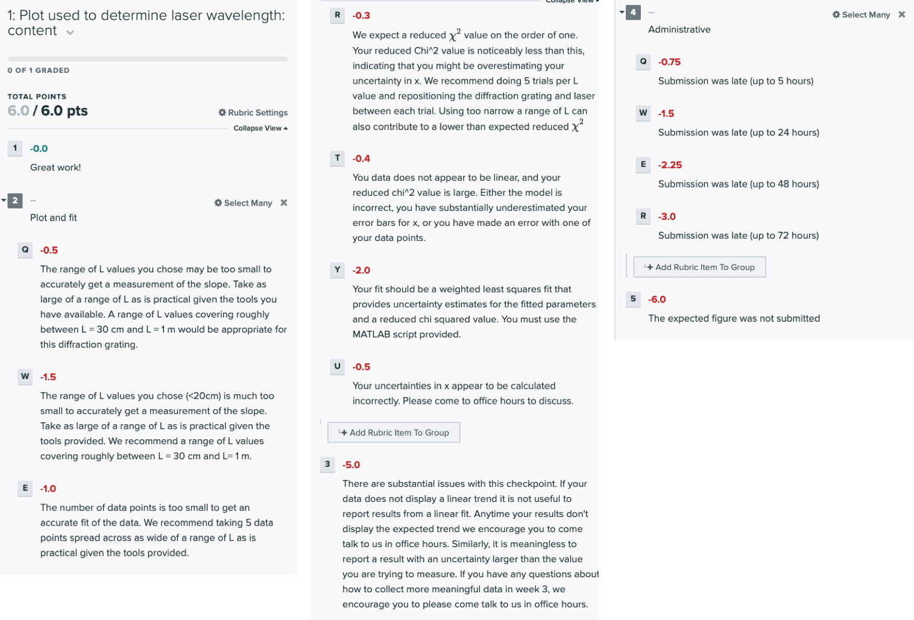
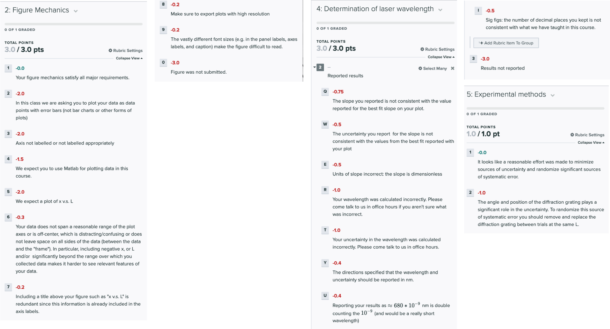

# Week 2

--------------
1. [Overview of Week 2](#overview-of-week-2)
2. [Why we measure $$x$$ over a range of $$L$$ values](#why-we-measure-x-over-a-range-of-l-values)
3. [Data Collection](#data-collection)
4. [Checkpoint 2](#checkpoint-2)

--------------

## Overview of Week 2

This week we will being our investigation of how the distance $$x$$ to the first bright spot depends on $$L$$, which will ultimately lead us to obtain an estimate of the wavelength $$\lambda = d \frac{x}{L}$$. Our approach will be to plot $$x$$ vs. $$L$$ and find the best fit line to that data. Based on the [background theory](background-theory){:target="_blank"} presented last week, the slope of the line will equal the ratio $$\lambda/d$$ of the wavelength to the grating spacing. Let's start with a practice calculation.

#### Miniquestion 1: Calculating wavelength from slope
[*Click here to open in a new tab*](https://forms.gle/MPYx6nPVd54jYE359){:target="_blank"}
<iframe src="https://docs.google.com/forms/d/e/1FAIpQLSct57YgYJ1rxsHAkhGfOk_QUB638pb_MYeH7vhVZU2MGQUW5w/viewform?embedded=true" width="640" height="400" frameborder="0" marginheight="0" marginwidth="0">Loading…
</iframe>

---------------------------
Why don't we just always get $$\lambda$$ by measuring $$x$$, determining $$\lambda= d \frac{x}{L}$$ for each measurement and then averaging those? Consider this: what if there is a systematic uncertainty in $$L$$, eg. due to accidentally measuring to a baseboard or because your ruler didn't start at zero? Then plotting a line will still give the correct slope, while the individual $$\lambda$$ values would each be systematically off. The line would have a non-zero intercept that would tell you about the systematic shift in $$L$$, as shown in the plot below, where the fitting parameter $$b$$ shown in the legend is clearly not equal to zero.

Nevertheless, it is useful to do a very quick "back-of-the-envelope" check to make sure that your value for wavelength is roughly in the range you'd expect (600-700 nm).  Go back to the data you collected last week. Pick a single value of $$x$$ and $$L$$ and check whether the value of $$d \frac{x}{L}$$ lies within the range you expect for the wavelength. (Hint: the wavelength of red light ranges from 620nm-700nm.) 

## Why we measure $$x$$ over a range of $$L$$ values

One of the most important ideas we want you to take from Module 3 is to think of a data set as a whole, not as individual points. 

In the "back-of-the-envelope" check you just did, you measured $$x$$ at a single value of $$L$$. But $$L$$ provides us with an independent variable that we can control, so by measuring $$x$$ over a range of $$L$$ values, we can create a plot of $$x$$ versus $$L$$ data. Plotting the data and looking at the data set as a whole gives us confidence in our ability to determine $$\lambda$$, since it allows us to fit the data to the theoretical prediction in a more robust way. 

Thinking back to the theoretical prediction $$\lambda = d \frac{x}{L}$$, let's rewrite that equation in a more suggestive form
\begin{equation}
x = \left(\frac{\lambda}{d}\right) L + 0
\end{equation}
where we have added zero to the right hand side. This should look familiar, it's the equation of a straight line (classic "$$y=mx+b$$"). That is, if we plotted $$x$$ versus $$L$$, we'd get a slope $$m=\lambda/d$$, and an intercept $$b=0$$. There's an added power to treating the data set as a whole in this way because if our data has an intercept that isn't zero, then that would suggest a systematic error that shifted our measured values!

How do we extract a slope and intercept from our measured data? You have previously fit a horizontal line, but now you will fit a line with a nonzero slope. To understand this fitting process, you now need to carefully read the [curve fitting guide](curve-fitting){:target="_blank"}. In it you will find a MATLAB script that includes a linear fit with both an intercept and a slope.

Please read the [curve fitting guide](curve-fitting){:target="_blank"} before answering the following miniquestion.

#### Miniquestion 2: Interpreting a weighted linear fit
[*Click here to open in a new tab (recommended)*](https://forms.gle/BF8fQq5PNWF1Gh9U8){:target="_blank"}
<iframe src="https://docs.google.com/forms/d/e/1FAIpQLSdTk_l5gJ2boQzujZcgNKYh55iSlxR9UZNke6sgi3Chk_dvmA/viewform?embedded=true" width="640" height="400" frameborder="0" marginheight="0" marginwidth="0">Loading…
</iframe>

 

## Data Collection

**This week you will collect data only for the 500 lines/mm grating spacing.**

When collecting data this week we would like you to take into consideration the sources of uncertainty you explored in Week 1 and do your best to minimize uncertainty and randomize systematic error by resetting the sensitive parameters between each trial. Please take a moment right now to go back to [Miniquestion 3 from Week 1](https://docs.google.com/forms/d/e/1FAIpQLSe-Bcw3iqEcmblnBnsOJOqSbfHVNrXckA4mVs9VEvzOXHvZQQ/viewform){:target="_blank"} and review your answers to determine which parameters you need to reset and which you don't.

To collect your complete $$x$$ vs. $$L$$ dataset, make sure to do the following:

+ Choose five values of $$L$$ ranging from about 30 cm to about 1 m, if your space allows it.

+ Collect five measurements of $$x$$ for each $$L$$ value, being sure to reset all the parameters you determined you needed to in  [Miniquestion 3 from Week 1](https://docs.google.com/forms/d/e/1FAIpQLSe-Bcw3iqEcmblnBnsOJOqSbfHVNrXckA4mVs9VEvzOXHvZQQ/viewform){:target="_blank"} between each measurement of $$x$$. If you found in Week 1 that $$x$$ depended sensitively on which diffraction grating you used, then you should switch diffraction gratings between measurements, being sure to **only use the 500 line/mm diffraction gratings.** 

+ For each $$L$$ value, compute the mean value of $$x$$ from your five trials and the random uncertainty as measured by the SEM. Then combine the random uncertainty with your resolution uncertainty in $$x$$ according to the [method for combining independent sources of uncertainty from Module 1](https://physics-50.github.io/Module-1/uncertainty-introduction#combining-uncertainties){:target="_blank"} to determine your total uncertainty in $$x$$, which we call $$\delta x$$.

+ Enter your $$x\pm \delta x$$ and $$L$$ data into the MATLAB curve fitting script called "curve_fitting_demo.m" from the [curve fitting guide](curve-fitting){:target="_blank"} and run the code to perform a best fit analysis.

+ You should make use of your data, the best fit analysis and the provided theory to determine the wavelength of your laser. You will need to use the methods you have been taught in the previous units to propagate your uncertainty and determine the uncertainty in your final result. 

+

-------------

## Checkpoint 2

You should submit the following on Gradescope:

+ The plot used to determine the wavelength of your laser. This plot must include the uncertainties on your data points and include a line of best fit that has been determined with a weighted fit. As always, make sure to include units on your axis labels. You will be asked to upload this plot 3 times. You should upload the same plot each time. You do not need to write a caption.

+ A link to a spreadsheet with your experimental data.

+ A sample calculation of wavelength and uncertainty, instructions for which are provided in the checkpoint instructions on Gradescope.

+ The slope you obtained from your plot, including the uncertainty. 

+ The wavelength you have determined for your laser, with uncertainty.

+ A list of the parameters you reset between each $$x$$ measurement.

-------------

## Grading rubric
The tentative rubric that will be used to evaluate this deliverable is provided below. Please keep in mind that these rubric items are subject to change as we can never foresee all the issues that may arise. This is meant to give you a sense of how it will be graded. You can click on the rubric to enlarge it.

The checkpoint will be graded out of 15 points.

{:target="_blank"}

{:target="_blank"}

## Mini-questions:

And to double-check, make sure you have finished all of this week's mini-questions by [checking here](mini-questions#week-2){:target="_blank"}

When you're all finished and ready to move on, you can start [Week 3](week3).
